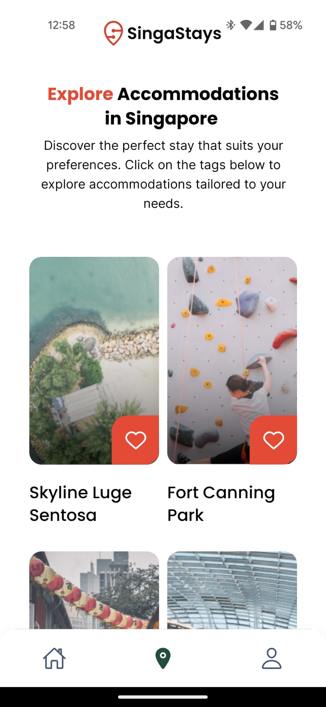
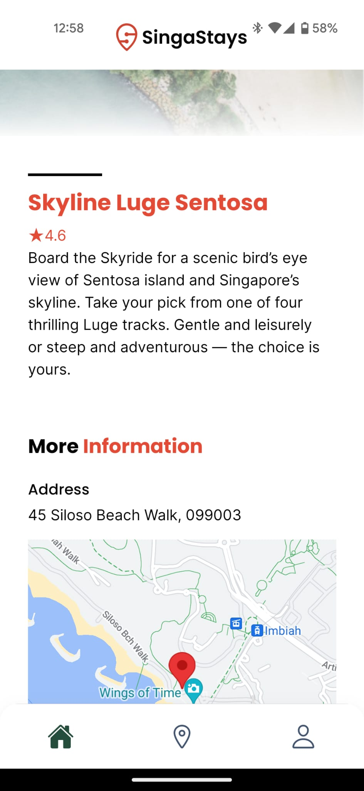
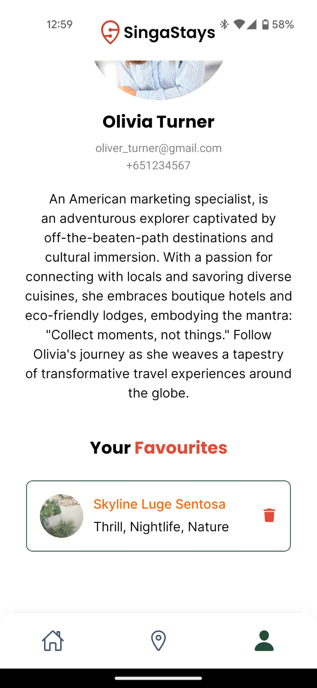

# SingaStays Mobile

SingaStays Mobile is a mobile application mock-up of [SingaStays](https://github.com/toonuaaa/SingaStays). SingaStays was designed to help users find attractions in Singapore. Users could browse attractions listing, view details, and add attractions to their favourites.

## Table of Contents

- [Features](#features)
- [Tech Stack](#tech-stack)
- [Installation](#installation)
- [Screenshots](#screenshots)
- [Limitations](#limitations)
- [Group Contributions](#group-contributions)

## Features

- Browse attractions listing
- View detailed information for each attraction
- Add attractions to favourites
- View favourites in the profile section

## Tech Stack

- React Native
- Expo
- JavaScript

## Installation

1. **Clone the repository:**

   ```sh
   git clone https://github.com/toonuaaa/SingaStays-mobile.git
   cd .\SingaStays-mobile\singastays\
   ```

2. **Install dependencies:**

   ```sh
   npm install
   ```

3. **Start the Expo development server:**

   ```sh
   npx expo start
   ```

4. **Run the app on a mobile device or emulator:**
   - For iOS: Use the Expo Go app to scan the QR code generated by the Expo server.
   - For Android: Use the Expo Go app to scan the QR code, or run the app on an Android emulator.

## Screenshots

Users can browse and view attractions information. [View demo](screenshots/attractions.mp4)

<p float="left">
  
   
   
</p>

Users can add attractions to favourites and view them in the profile page. [View demo](screenshots/favourites.mp4)



## Limitations

- This project has limited interactivity and is for demo purposes only.
- The app fetches static data and does not connect to a live backend.
- Favourites are stored in app state and will be lost upon app restart.
- User profile page is a placeholder and not customisable.

## Group Contributions

This project was developed by a team of contributors. The key features and initial implementation were done by:

- Lin Xuan: Worked on attraction detail page and MapView library integration.
- Aishah: Worked on home page, favourites implementation, screens navigation and UI design.
- YH: Worked on profile page and app state management.
- Travis: Worked on attractions listing page.

[Original GitHub Repository](https://github.com/Aishahaha/singastays-m5-project)
